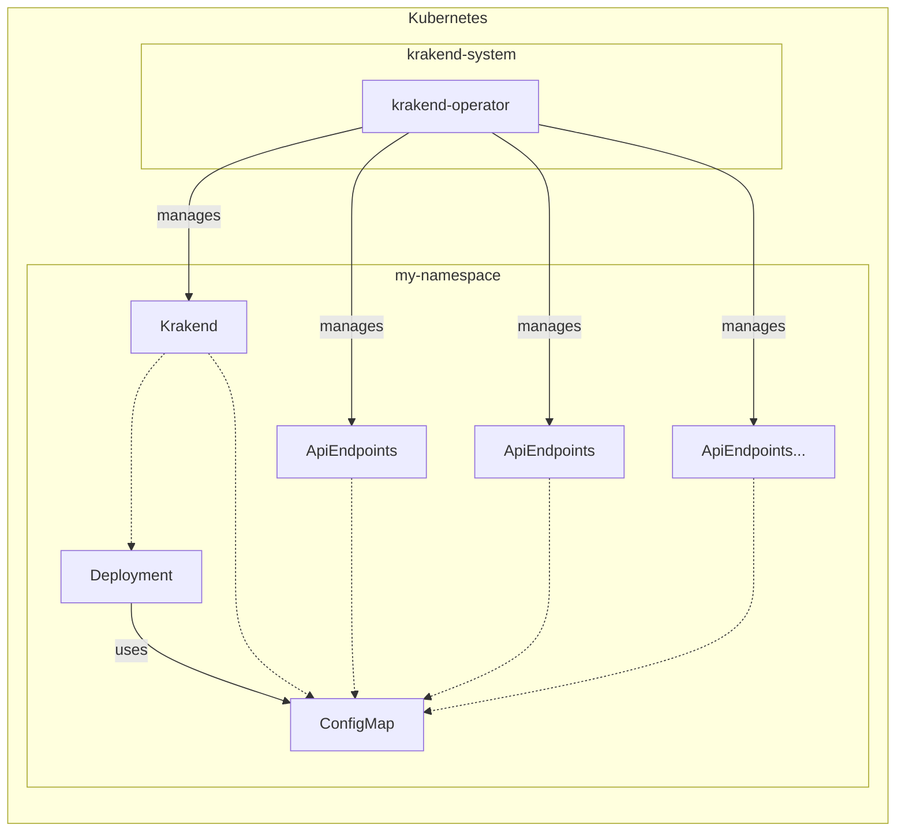

# krakend-operator

Kubernetes operator for installing and managing [KrakenD](https://www.krakend.io/) - an open-source API Gateway - in kubernetes namespaces.

## Description
The operator's main purpose is two-fold:
* installing and managing the KrakenD API Gateway in kubernetes namespaces
* managing the configuration of the KrakenD API Gateway, i.e. the APIs that will be exposed through the gateway

Currently, the operator supports the following custom resources:
* `Krakend` for installing and updating the KrakenD API Gateway in the namespace by utilizing the [KrakenD Helm chart](https://www.krakend.io/docs/deploying/kubernetes/#helm-chart)
* `ApiEndpoints` for adding APIs to KrakenD configuration providing sane defaults such as authentication and rate limiting

The operator is built using the [Kubebuilder](https://book.kubebuilder.io/) framework.



### Krakend Kind

The purpose of the `Krakend` kind is to install and manage the KrakenD API Gateway in a namespace. 

Currently the operator support the following features:

* common authentication provider config which can be used across multiple API endpoints
* configuration of ingress settings such as ingress class and annotations
* control aspects of the deployment, such as number of replicas, resource requirements, krakend image, or extra environment variables

The following example will create a deployment with 2 replicas for krakend in the namespace `my-namespace` with an ingress of `https://my-namespace.nais.io`:

```yaml

apiVersion: krakend.nais.io/v1
kind: Krakend
metadata:
  name: my-namespace
  namespace: my-namespace
spec:
  ingress:
    enabled: true
    className: your-ingress-class
    annotations: {}
    hosts:
      - host: my-namespace.nais.io
        paths:
          - path: /
            pathType: ImplementationSpecific
  authProviders:
    - name: some-jwt-auth-provider # this name will be used in the api endpoint config
      alg: RS256
      jwkUrl: https://the-jwk-url
      issuer: https://the-jwt-issuer
  deployment:
    replicaCount: 2
    image:
      tag: 2.4.3
    resources:
      limits:
        cpu: 100m
        memory: 128Mi
      requests:
        cpu: 100m
        memory: 128Mi
```

For more details take a look at the [samples](./config/samples/) directory or the CRD definition [here](./config/crd/bases/krakend.nais.io_krakends.yaml).

### ApiEndpoints Kind

The purpose of the `ApiEndpoints` kind is to add APIs to the KrakenD configuration. 
The [configuration](https://www.krakend.io/docs/endpoints/) of API endpoints in KrakenD is quite flexible and complex, so the `ApiEndpoints` kind is created as an abstraction to simplify 
and provide sane defaults for common use cases. 

In KrakenD you can specify features such as authentication and rate limiting on a per-endpoint basis, we have chosen to specify these features on a per-app basis.

The `ApiEndpoints` resource splits the configuration of an app's API endpoints into two parts:

* `endpoints` - secure API endpoints requiring authentication
* `openEndpoints` - open API endpoints not requiring authentication, .e.g. documentation or OpenAPI specs

Currently we support the following KrakenD features:
* [JWT validation](https://www.krakend.io/docs/authorization/jwt-validation/): authentication for a secured endpoint is defined by specifying the name of an authentication provider defined in the `Krakend` resource.
* [Rate-limiting](https://www.krakend.io/docs/endpoints/rate-limit/): if rate-limiting is defined it is applied to all `endpoints` and `openEndpoints` defined in the `ApiEndpoints` resource.

Note: There are some strict requirements on specifying paths, query params and headers in KrakenD, see [here](https://www.krakend.io/docs/endpoints/) and the [ApiEndpoints CRD](./config/crd/bases/krakend.nais.io_apiendpoints.yaml) for details.

The following example will expose two API endpoints requiring authentication and one open endpoint for the app `app1` in the namespace `my-namespace` using a common rate-limiting configuration:

```yaml
apiVersion: krakend.nais.io/v1
kind: ApiEndpoints
metadata:
  name: app1
  namespace: my-namespace
spec:
  appName: app1
  auth:
    name: some-jwt-auth-provider
    cache: true
    debug: true
    audience:
      - "audience1"
    scope:
      - "scope1"
      
  rateLimit:
    maxRate: 10
    clientMaxRate: 0
    strategy: ip
    capacity: 0
    clientCapacity: 0
    
  endpoints:
    - path: /app1/somesecurestuff
      method: GET
      backendHost: http://app1
      backendPath: /somesecurestuff
    - path: /anotherapp
      method: GET
      backendHost: https://anotherapp.nais.io
      backendPath: /
  openEndpoints:
    - path: /doc
      method: GET
      backendHost: http://app1 
      backendPath: /doc
```

For more details take a look at the [samples](./config/samples/) directory or the CRD definition [here](./config/crd/bases/krakend.nais.io_apiendpoints.yaml).

## Development
You’ll need a Kubernetes cluster to run against. You can use [KIND](https://sigs.k8s.io/kind) to get a local cluster for testing, or run against a remote cluster.
**Note:** Your controller will automatically use the current context in your kubeconfig file (i.e. whatever cluster `kubectl cluster-info` shows).

### Running on local cluster
1. Install Instances of Custom Resources:

```sh
kubectl apply -k config/samples/
```

2. Build and push your image to the location specified by `IMG`:

```sh
make docker-build docker-push IMG=<some-registry>/krakend:tag
```

3. Deploy the controller to the cluster with the image specified by `IMG`:

```sh
make deploy IMG=<some-registry>/krakend:tag
```

### Uninstall CRDs
To delete the CRDs from the cluster:

```sh
make uninstall
```

### Undeploy controller
UnDeploy the controller from the cluster:

```sh
make undeploy
```

## Contributing
// TODO(user): Add detailed information on how you would like others to contribute to this project

### How it works
This project aims to follow the Kubernetes [Operator pattern](https://kubernetes.io/docs/concepts/extend-kubernetes/operator/).

It uses [Controllers](https://kubernetes.io/docs/concepts/architecture/controller/),
which provide a reconcile function responsible for synchronizing resources until the desired state is reached on the cluster.

### Test It Out
1. Install the CRDs into the cluster:

```sh
make install
```

2. Run your controller (this will run in the foreground, so switch to a new terminal if you want to leave it running):

```sh
make run
```

**NOTE:** You can also run this in one step by running: `make install run`

### Modifying the API definitions
If you are editing the API definitions, generate the manifests such as CRs or CRDs using:

```sh
make manifests
```

**NOTE:** Run `make --help` for more information on all potential `make` targets

More information can be found via the [Kubebuilder Documentation](https://book.kubebuilder.io/introduction.html)


